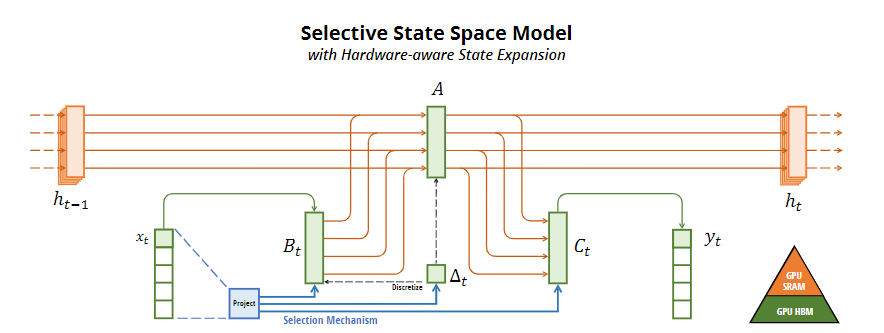

# :rocket: Multimodal Research Transformer

## 1.Mamba Base :book:

  
(Overview.) Structured SSMs independently map each channel (e.g. 𝐷 = 5) of an input 𝑥 to output 𝑦 through a higher
dimensional latent state ℎ (e.g. 𝑁 = 4). Prior SSMs avoid materializing this large effective state (𝐷𝑁 , times batch size 𝐵 and sequence
length 𝐿) through clever alternate computation paths requiring time-invariance: the (Δ, 𝑨, 𝑩, 𝑪) parameters are constant across time. Our
selection mechanism adds back input-dependent dynamics, which also requires a careful hardware-aware algorithm to only materialize
the expanded states in more efficient levels of the GPU memory hierarchy.  
