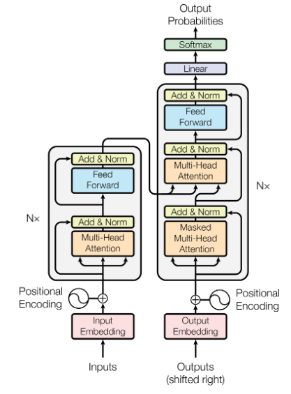
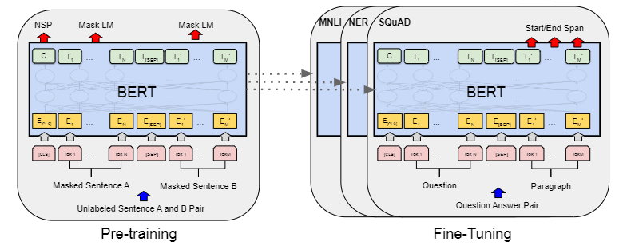

    

# :rocket: Multimodal-Research Transformer :rocket:

## 1.Multimodal-Research Transformer :book:

    

Transformer base code comes from the [Attention Is All You Need] (https://arxiv.org/pdf/1706.03762v7) paper.  
And the code is in the [models' folder](/base/models) you can read.  

__Abstract__: The dominant sequence transduction models are based on complex recurrent or
convolutional neural networks that include an encoder and a decoder. The best
performing models also connect the encoder and decoder through an attention
mechanism. We propose a new simple network architecture, the Transformer,
based solely on attention mechanisms, dispensing with recurrence and convolutions
entirely. Experiments on two machine translation tasks show these models to
be superior in quality while being more parallelizable and requiring significantly
less time to train. Our model achieves 28.4 BLEU on the WMT 2014 English-
to-German translation task, improving over the existing best results, including
ensembles, by over 2 BLEU. On the WMT 2014 English-to-French translation task,
our model establishes a new single-model state-of-the-art BLEU score of 41.8 after
training for 3.5 days on eight GPUs, a small fraction of the training costs of the
best models from the literature. We show that the Transformer generalizes well to
other tasks by applying it successfully to English constituency parsing both with
large and limited training data.

## 2.Multimodal-Research Bert :computer:

    

Bert base code comes from the [BERT: Pre-training of Deep Bidirectional Transformers for Language Understanding](https://arxiv.org/pdf/1810.04805v1.pdf) paper. And the code is in the [models' folder](/bert/models) you can read.

__Abstract__: Fine-tuning large pre-trained models is an effective transfer mechanism in NLP. However, in the
presence of many downstream tasks, fine-tuning is parameter inefficient: an entire new model is
required for every task. As an alternative, we propose transfer with adapter modules. Adapter
modules yield a compact and extensible model; they add only a few trainable parameters per task,
and new tasks can be added without revisiting previous ones. The parameters of the original
network remain fixed, yielding a high degree of parameter sharing. To demonstrate adapter’s ef-
fectiveness, we transfer the recently proposed BERT Transformer model to 26 diverse text clas-
sification tasks, including the GLUE benchmark. Adapters attain near state-of-the-art performance,
whilst adding only a few parameters per task. On GLUE, we attain within 0.4% of the performance
of full fine-tuning, adding only 3.6% parametersper task. By contrast, fine-tuning trains 100% of
the parameters per task.1  
