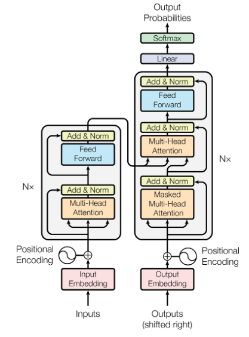
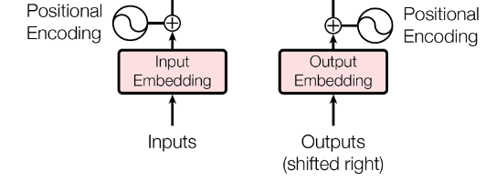
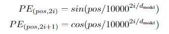
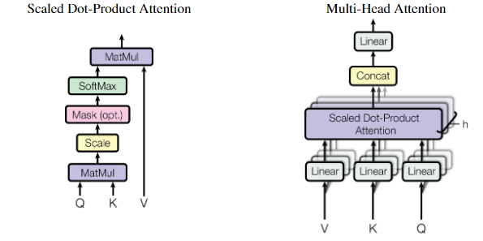
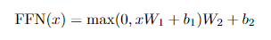

# :rocket:Transformer

Transformer base code comes from the [Attention Is All You Need](https://arxiv.org/pdf/1706.03762v7) paper. It contains Postional Encoding, Multi-Head Attention, Feed Forward Network, Layer Normalization, Dropout, and Residual Connection modules. And the code is in the [models' folder](transformer/base/models) you can read.  

## Model Architecture:bulb:

The Transformer follows this overall architecture using stacked self-attention and point-wise, fully
connected layers for both the encoder and decoder, shown in the left and right halves of Figure 1,
respectively.  
  
___Encoder___: The encoder is composed of a stack of N = 6 identical layers. Each layer has two sub-layers. The first is a multi-head self-attention mechanism, and the second is a simple, position-wise fully connected feed-forward network. We employ a residual connection around each of the two sub-layers, followed by layer normalization. That is, the output of each sub-layer is LayerNorm(x + Sublayer(x)), where Sublayer(x) is the function implemented by the sub-layer itself. To facilitate these residual connections, all sub-layers in the model, as well as the embedding
layers, produce outputs of dimension dmodel = 512.  
___Decoder___: The decoder is also composed of a stack of N = 6 identical layers. In addition to the two sub-layers in each encoder layer, the decoder inserts a third sub-layer, which performs multi-head attention over the output of the encoder stack. Similar to the encoder, we employ residual connections around each of the sub-layers, followed by layer normalization. We also modify the self-attention
sub-layer in the decoder stack to prevent positions from attending to subsequent positions. This masking, combined with fact that the output embeddings are offset by one position, ensures that the predictions for position i can depend only on the known outputs at positions less than i.  

## Positional Encoding:book:

  
  
In order for the model to take advantage of the sequence's order, we have to inject some information about the relative or absolute positions in the sequence. To do this, we add "position encoding" to the input embeddings at the bottom of the encoder and decoder stack. Position encoding has the same dimensional dmodel as embedding, so the two can be added. There are many options for position encoding, learned and fixed. We use sine and cosine functions with different frequencies.

```bash
# you can read in the transformer\base\models\embedding\positional_encoding.py
class PositionalEncoding(nn.Module):
    """compute positional encoding for input sentense:
    :param d_model: dimension of model
    :param max_len: max length of input sentense
    :param device: hardware device setting """
    def __init__(self, d_model, max_len, device):
        super(PositionalEncoding, self).__init__()
        # same size with input matrix for adding with input matrix
        self.encoding = torch.zeros(max_len, d_model, device=device)
        self.encoding.requires_grad = False

        # 1D => 2D unsqueeze to represent word's postion
        pos = torch.arange(0, max_len, device=device)
        pos = pos.float().unsqueeze(dim=1)
        
        # 'i' means index of d_model (e.g. embedding size = 50, 'i' = [0,50])
        # "step=2" means 'i' multiplied with two (same with 2 * i)
        _2i = torch.arrange(0, d_model, step=2, device=device)

        self.encoding[:, 0::2] = torch.sin(pos / (10000 ** (_2i / d_model)))
        self.encoding[:, 1::2] = torch.cos(pos / (10000 ** (_2i / d_model)))

    def forward(self, x):
        # self.encoding [max_len=512, d_model=512]
        # [batch_size=128, seq_len=30]
        batch_size, seq_len = x.size()

        # [seq_len = 30, d_model = 512]
        # it will add with tok_emb : [128, 30, 512]
        return self.encoding[:seq_len, :]
```

## Attention:book:

  
The attention function can be described as mapping a query and a set of key-value pairs to an output, where the query, keys, values, and outputs are all vectors. The outputs are computed as a weighted sum of the values, where the weight assigned to each value is computed by a compatibility function of the query with the corresponding key.

```bash
# you can read the code  in transformer\base\models\layers\multi_head_attention.py
class MultiHeadAttention(nn.Module):
    def __init__(self, d_model, n_heads):
        super(MultiHeadAttention, self).__init__()
        self.n_heads = n_heads  
        self.attention = ScaleDotProductAttention() 
        self.w_q = nn.Linear(d_model, d_model)
        self.w_k = nn.Linear(d_model, d_model)
        self.w_v = nn.Linear(d_model, d_model)
        self.w_concat = nn.Linear(d_model, d_model)

    def forward(self, q, k, v, mask=None):
        # 1. dot product with weight matrices
        q, k, v = self.w_q(q), self.w_k(k), self.w_v(v)
        # 2. split tensor by number of heads
        q, k, v = self.split(q), self.split(k), self.split(v)
        # 3. dot product with weight matrices
        out, attention = self.attention(q, k, v, mask=mask)
        # 4. concat and pass to linear layer
        out = self.concat(out)
        out = self.w_concat(out)
        return out
```

## Feed Forward :book:

  
In addition to attention sub-layers, each of the layers in our encoder and decoder contains a fully connected feed-forward network, which is applied to each position separately and identically. This consists of two linear transformations with a ReLU activation in between.  

```bash
# you can read the code  in transformer\base\models\layers\feed_forward.py
class FeedForward(nn.Module):
    def __init__(self, d_model, hidden, drop_prob=0.1):
        # two layers of MLP
        super(FeedForward, self).__init__()
        self.linear1 = nn.Linear(d_model, hidden)
        self.linear2 = nn.Linear(hidden, d_model)
        self.relu = nn.ReLU()
        self.dropout = nn.Dropout(drop_prob)

    def forward(self, x):
        # nonlinear transformation
        x = self.relu( self.linear1(x) )
        # linear transformation and for residual join
        x = self.linear2( self.dropout(x) )
        return x
```
